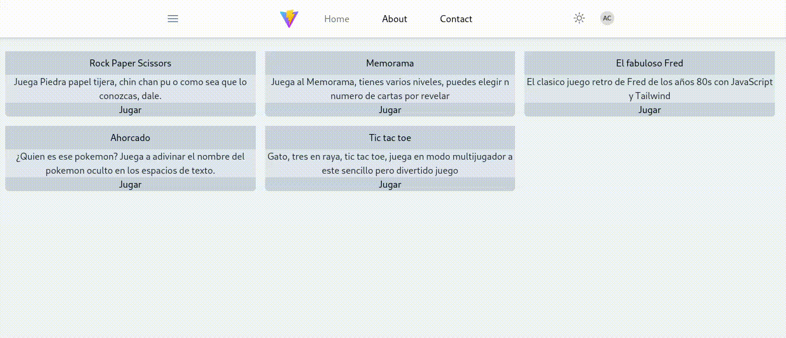

# ¿Te gustan los juegos clásicos y la programación web moderna?

Este repositorio es para ti. Aquí encontrarás una aplicación de vite con tailwind y javascript que te permite jugar a varios juegos divertidos como piedra papel tijera, memorama, y el fabuloso fred. Estos juegos son fáciles de aprender, pero difíciles de dominar. Además, podrás ver el código fuente y aprender cómo se crearon estos juegos usando tecnologías modernas.

## El clásico y Fabuloso fred



## Gato / 3 en raya


## memorama

## Clona y modificalo a tu gusto

```
git clone https://github.com/AlanCienega/js-minigames.git
cd js-minigames
npm run dev
```
